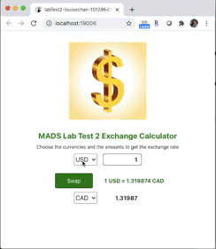

# Currency Converter (React Native App)
#### A currency converter app written using the React Native framework and runs on the iOS, Android and web platforms.

#### Technology/Concepts Used

* Class-based components

* RESTful APIs

* Parent to child component data passing

* Child to Parent component data passing

* States and Props

* ComponentDidUpdate lifecycle hook processing

#### Android screenshots

          
#### iOS screenshots

          

#### Web screenshots

          

#### Features

* Currency conversion between CAD, USD, EUR, GBP based on current rates available api.exchangerate-api.com.

* Currency selected can be swapped by button click.

* Auto-conversion of currency when user inputs value in textbox.

* Runs on Android, iOS and web platforms.

#### Link to specification: <a href="./docs/MADS4008-Lab Test 2.pdf" target="_blank">[App Specification]</a>
